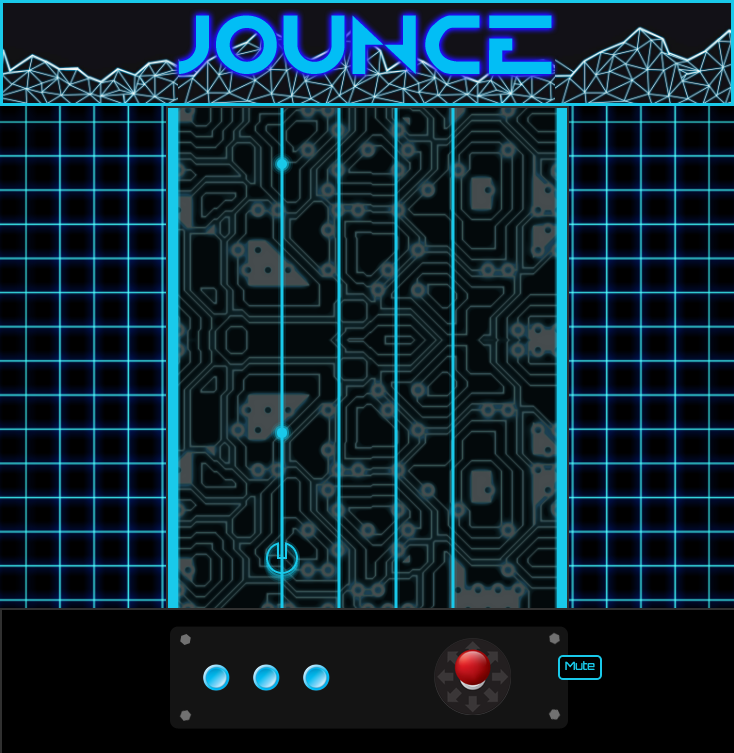

# Jounce

## Background

Jounce is a retro 1980s arcade game, incorporating the themes of Tron with elements from various rhythm games like Rockband or Guitar Hero.  The live version can be found at https://kestralttr.github.io/jounce/.

Four vertical lines show the incoming trajectories that incoming energy packets can travel from the top of the screen to the bottom.  The circular item at the bottom of the screen is the sprite, or the ship that the player controls.  The player moves the sprite left and right to catch all the energy.  Missing too many energy packets results in a game over.

## Instructions

Controls are quite simple.  The left and right arrow keys move the sprite in the corresponding directions, while space starts (or restarts a game) and the 'P' key pauses the game.  A mute button is available to silence the game if desired.

Sound effects will mark various events, like grabbing an energy packet, missing an energy packet, and losing the game.  Visual cues are also available, with the entire game changing color every time an energy packet is missed, from blue to yellow to orange to red.  Energy packets will speed up gradually over time, with the game becoming increasingly more difficult the longer it is played.

## Technologies & Strategies

Jounce is written in JavaScript, relying heavily on HTML5 Canvas, while also using jQuery.  The game runs on a setInterval method that has a refresh rate of 60 frames a second.  A single class (gameView) is responsible for keeping track of the game's state data, and passes this data into various imported classes and methods in order to dynamically refresh the canvas.

An interesting aspect of Jounce is generating the illusion of movement.  A major step towards achieving this relies on the generation of an infinite background loop, which appears as if your sprite is flying over 1980s circuitry for the duration of a game.  This effect was crafted by creating an image that has a top border that fits seamlessly against the bottom border.  A new image file is created, which takes this background image and duplicates it so that there are two identical background images, one above the other.  This new image file is then imported into Canvas, and changes its y-coordinates over time.  However, since there are two background images next to each other, there is another position at any given y-coordinate where the image file will look exactly the same.  After identifying the other position, it's simply a matter of instructing Canvas to jump back to the first position when it reaches the second that allows the background to appear that it is infinitely looping.  The snippet below shows the simple code necessary once the positions have been calculated (matte refers to the looping background):

  if (this.matteY >= -300) {
    this.matteY = -1100;
  }
  const matteObj = new Matte(this.ctx,this.matteY,this.matteMovY);
  matteObj.drawMatte();

  this.matteY += this.matteMovY;

The CSS involved with creating the feel of an arcade game relies on various container tags wrapping backgrounds, images, and text where applicable.  In order to ensure that the feel of a 1980s arcade machine is clear across a myriad of dimensions and screen sizes, many of the HTML elements have been positioned directly, allowing for their persistence even when the window is resized.

All audio effects are established in HTML and use jQuery to enable or disable them.  Since the entry file has direct access to the index file, all audio commands and keybindings are done in entry.js.

## Future Features

There are a number of additional features that are planned for this game.  First of all, some sort of counter that would allow you to regain health would allow for more forgiving gameplay.  Conversely, it would be fairly straightforward to add "bad" energy packets that would be marked in a different color and would harm you rather than help you.

Finally, instead of a music file playing over the entire game, using music loops based on the moments when energy packets are caught would allow the player to essentially create the song that is supposed to play with their gameplay.  This would likely require dynamic modifications to the speed of the music loops as the game speed increases, but the result would be much more rewarding.
