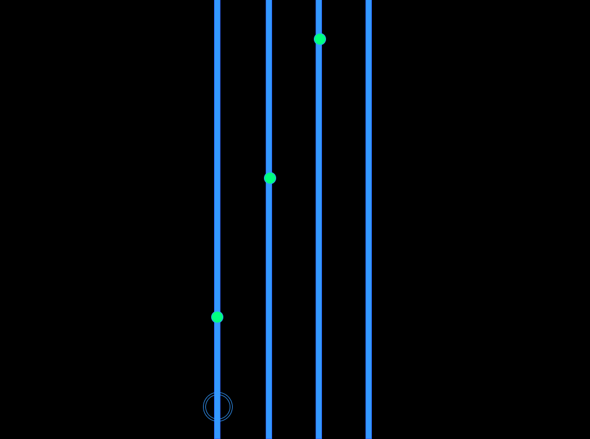

# Jounce

## Background

Jounce is a revamped rhythm game, similar to Rockband or Guitar Hero.  This gameplay is combined with music and visual elements from Tron and various 80s pop culture themes.

Four vertical lines in the game show the potential trajectories along which incoming Notes travel from the top of the screen to the bottom.  The player controls a Sprite at the bottom of the screen.  The left and right arrow keys can move the Sprite left and right, jumping to the whatever line is next to the line the Sprite is currently occupying.  This allows the player to move the Sprite across the four lines, attempting to "catch" the Notes before they leave the bottom of the screen.  Notes can only be caught my tapping the spacebar while a Note is in contact with the Sprite.

## Functionality & MVP

In Jounce, players can look forward to doing the following:

- Use arrow keys and the spacebar to manipulate their Sprite into position to catch incoming Notes.
- Upon catching or missing Notes, the game elements will change color.
- Pause and unpause the game (which will mute/unmute music).

Extra goodies:

- An intro screen that will display the rules of the game, along with a key map.
- A production ReadMe.

## Architecture and Technologies

- Vanilla JavaScript and jquery will be used for the structure and logic of the game.
- HTML5 Canvas will be used to render and manipulate the DOM.
- Webpack will bundle and serve the relevant scripts.

The scripts used to create and run the game will include the following:

- render.js
  - This script will render all elements to the DOM.

- logic.js
  - This script will handle all the behind-the-scenes logic that determines the values that will affect the rendering of the display.  It will analyze all existing elements and perform the necessary calculations to return a new state.

- elements.js
  - This script holds the details and functions directly related to the elements that are included in the game.

## Implementation Timeline

### Day 1
Set up the project scripts, along with webpack.  Review HTML5 Canvas commands and structure.  Set up the entry file and a working render class.

- Successful webpack installation
- Entry file and framework of all three script files.

### Day 2
Focus on programming Sprite movement between lines.  Also complete creation, movement, and expiration of Notes.  Notes should expire when they extend collide with the bottom of the screen.

- Working Sprite element is bound to arrow keys and jumps between lines.
- Notes can be created and will travel down a line until they hit the bottom of the display.

### Day 3
Create logic for the backend.  Create methods that allow for Notes to be caught and that update state based on whether they are caught or not.  Also create logic for the randomization of Notes.

- Sprite should be able to catch and miss Notes based on use of the spacebar.
- Notes should appear in a random order but at a specific interval.
- Catches and misses should update the state (element colors).

### Day 4
Install music that will play upon initialization of a new game, and should stay consistent with Note appearance/collision.  Install a pause button that pauses music.  Finish styling of page and instructions.

- Music plays upon game start and pauses with game pause.
- Game and instructions appear properly and are styled appropriately.
- Music follows Note creation & collision.

## Bonus

- Easy, medium, and hard modes that offer different songs and speeds.
- Additional Note patterns and lines.
- Moving background element that denotes a sensation of movement.
- Songs that autoform based on loops that play upon catching each Note.
